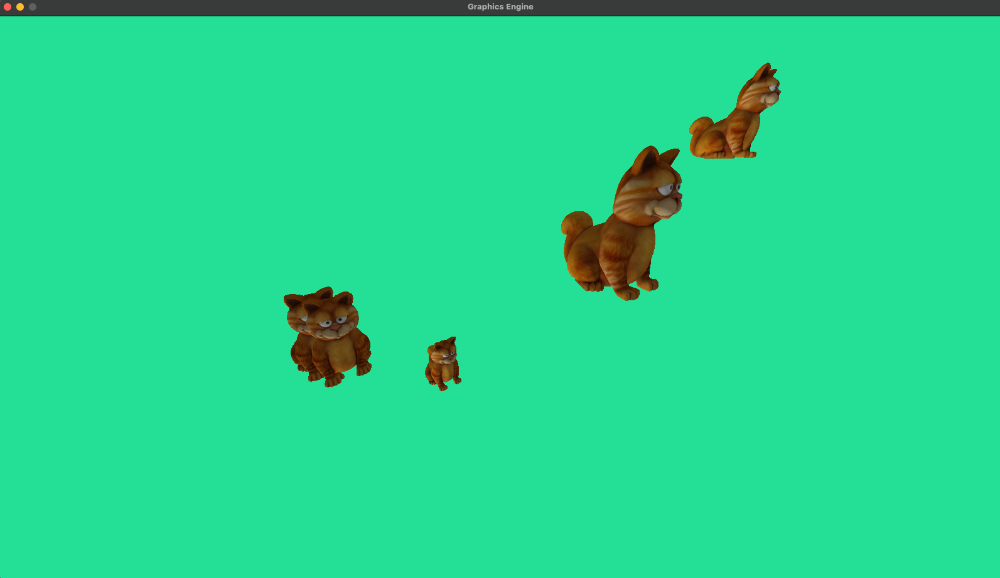
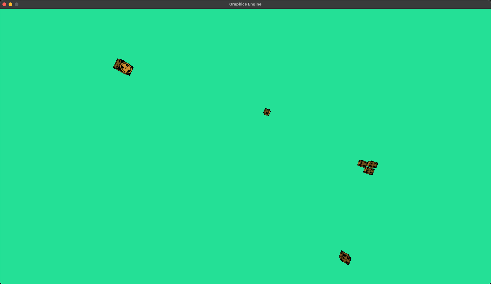
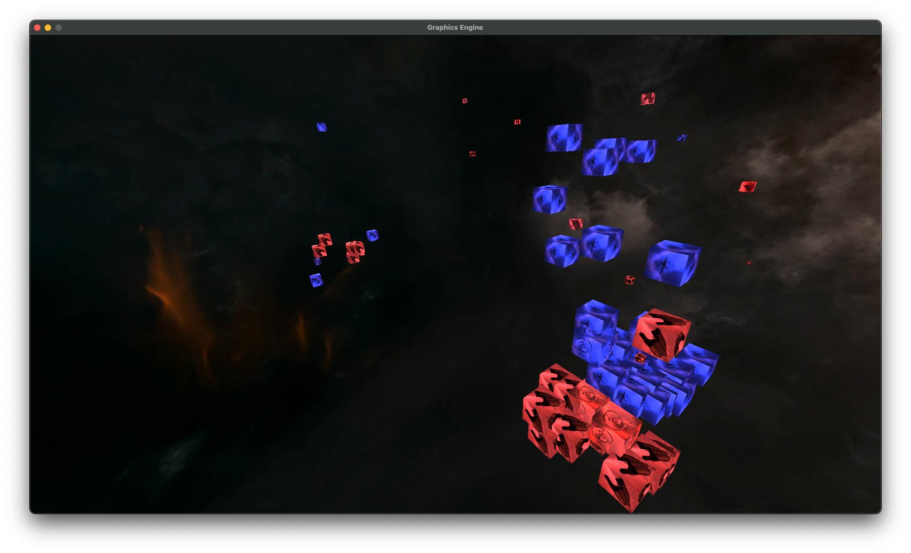

## zkillBattleVis
A tool to visualize zkillboard losses in the position of the system they were lost in.
Currently it will only work within one grid and displays the loss coordinates as a 3D object.

---

### How does it work?

- When running main.py currently...
- It will take a zkillboard battle report and parse it for the losses using the API.
- Note that you must use a report with a solarsystemid and a timestamp. Do not use saved ones.
- Wreck objects contain all the info about the wreck, including coordinates.
- The tool then scales coordinates down to their locals by running modulo and taking the last few digits.
- Scaling down further by 1000 brings them to a reasonable size for the window to represent a grid in-game.
- The coordinate are then plotted as cubes that represent the ship or character that died.
- Cubes are coloured blue or red depending on the team in the battle report.

Hold right click to bind the mouse to the window. (so you can fly).

WASD controls the flight. Press Esc to quit.

---

### What creates the 3D scene?

- The 3D scene is created using Pygame and PyOpenGL.
- The 3D scene is rendered using a ton of vector maths and a perspective projection matrix.
- [Follow this tutorial to recreate something like this](https://www.youtube.com/watch?v=eJDIsFJN4OQ) 

---

### To Do (eventually...)

- [x] Add a better wreck model (Kinda? It's a cube now with textures of the ship that died)
- [ ] Add camera control hints to the screen
- [x] Add a skybox
- [ ] Add another model to the screen so you can better understand the scale
- [ ] Improve the lighting
- [x] Fix the bug with the camera not capturing right click on start

---

