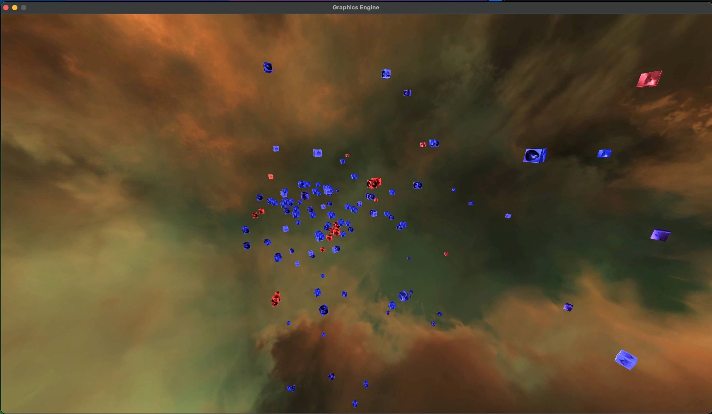
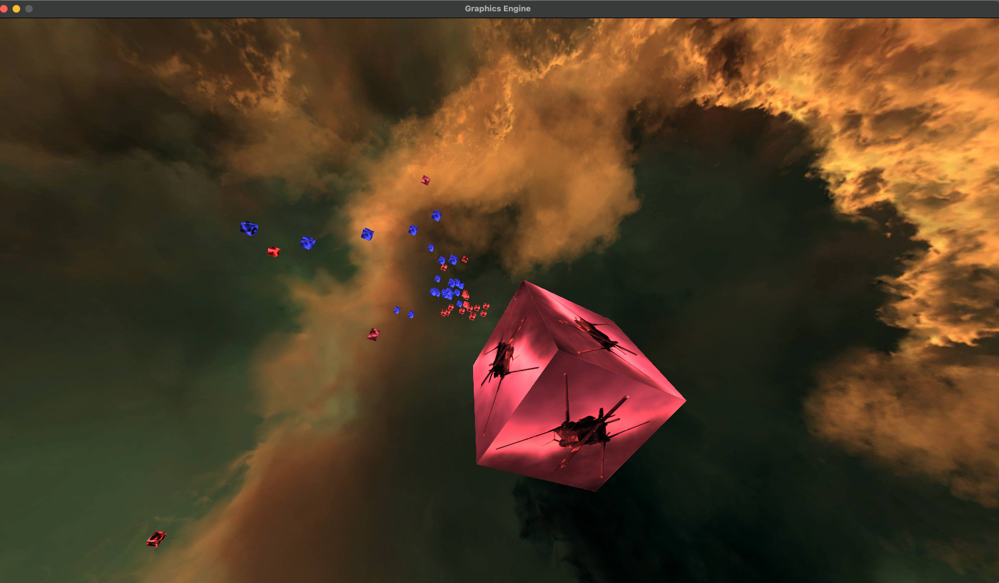

## zkillBattleVis
An EVE Online tool to visualize zkillboard battle report losses in the position of the system they were lost in.

> There is currently an issue with the shader rendering on Windows, sorry. You can still make use of this tool, though, to build Wreck objects.
> Run `import modules.controllers.facade as facade` and `wreck_list_a, wreck_list_b = facade.create_both_wreck_lists(br_url)` to create them.
> They contain positional data and pretty much everything else you need to work with this.

---

### How does it work?

- When running main.py currently...
- It will take a zkillboard battle report and parse it for the losses using the API.
- Note that you must use a report with a solarsystemid and a timestamp. Do not use saved ones.
- Wreck objects contain all the info about the wreck, including coordinates.
- The tool then scales coordinates down to their locals by running modulo and taking the last few digits.
- Scaling down further by 1000 brings them to a reasonable size for the window to represent a grid in-game.
- The coordinate are then plotted as cubes that represent the ship or character that died.
- Cubes are coloured blue or red depending on the team in the battle report.

---

### How to use

- Clone the repository using `git clone
- If you don't have it already, install Python 3.12
- Install the requirements using `pip install -r requirements.txt`
- Run the program using `python main.py`
- Enter a zkillboard battle report URL when prompted alongside a multiplier value for the wreck sizes (1 is fine)
- Wait a little bit. It will take about 20 seconds for a small BR and 2 minutes for a large one for example.
- Hold right click to bind the camera so you can look around
- Use WASD to fly
- Press Escape to exit

---

### Known issues

- The application appears to hang when it is loading. Just be patient.
- If you provide a battle report without kills on both sides, it falls over while looking for a list that doesn't exist
This is an easy fix, but I just want to get this version out there.
- In my brief test on Windows, my graphics engine failed to render lighting properly.
Not sure if this is a big issue

---

### How to contribute

- If you want to contribute, feel free to fork the repo and make a pull request.
- If you want to report a bug, please use the issues tab.
- If you want to suggest a feature, please use the issues tab.

No guarantee that I'll fix this or even make a new version. This was just for fun. 
Happy for anyone to take it and run with it.

---

### What creates the 3D scene?

- The 3D scene is created using Pygame and PyOpenGL.
- The 3D scene is rendered using a ton of vector maths and a perspective projection matrix.
- [Follow this tutorial to recreate something like this](https://www.youtube.com/watch?v=eJDIsFJN4OQ) 

---

### To Do (eventually...)

- [x] Add a better wreck model (Kinda? It's a cube now with textures of the ship that died)
- [ ] Add camera control hints to the screen
- [x] Add a skybox
- [ ] Add another model to the screen so you can better understand the scale
- [ ] Improve the lighting
- [x] Fix the bug with the camera not capturing right click on start
- [ ] Bugfixese (see known issues)
- [ ] If I really wanted to develop this properly, build it in an actual engine rather than my own custom one

---

---

